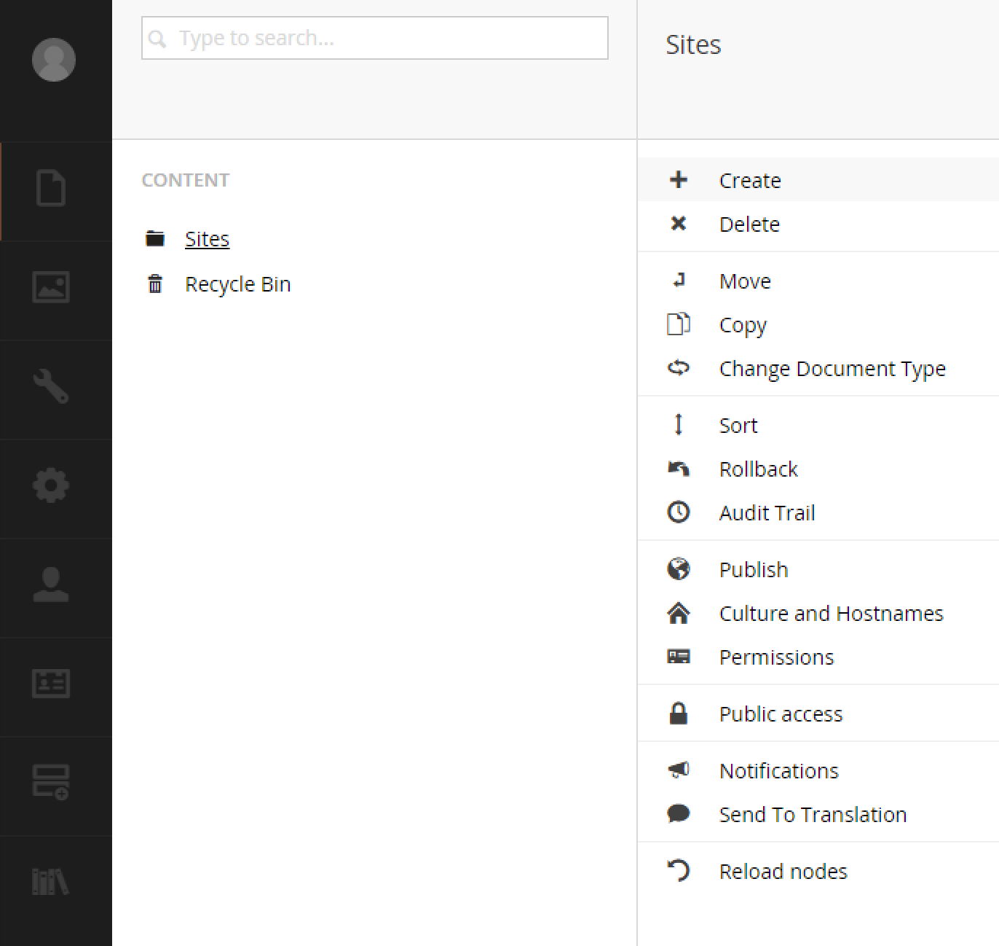

# Content Section

The content section is where all of the content (not media) is added to an Umbraco site.   During a fresh install, the only node that will be in your content tree will be the `Recycle Bin`.  All other pieces of content will need to be defined by a [document type](/Chapter%2003%20-%20Document%20Types,%20Templates%20and%20Data%20Types/01%20-%20Document%20Types.md).  The content section also will have a few dashboards by default like: `Get Started` and `Change Password`.

*If you installed a starter kit when you installed Umbraco, you will have some content (and document types) already.*

## Content Tree

The content tree is a hierarchy of document types and each one is affectionately called a node.  By nesting content nodes underneath each other, Umbraco builds the default URL based on the structure.

See how the URL's would be generated below as both a single site or a multi-site install: 
 
**Single Site**

    Home  "http://foo.com/"
    |---- About Us "/about-us"
    |---- Contact Us "/contact-us"
   
**Multi-site setup ([see chapter on multi-site configuration](/Chapter%2012%20-%20Multisite%20Configuration))**

    Sites
    |----Site 1
           |---- Home  "http://foo.com/"
                   |---- About Us "/about-us"
                   |---- Contact Us "/contact-us"
    |----Site 2
            |---- Home "http://bar.com/"
                    |---- About Us "/about-us
                    |---- Contact Us "/contact-us
                            |----- "Inquiry Form" /contact-us/inquiry-form

## A content node is the basic content building block in Umbraco

A content node...

* Represents a single document type
* Will have an icon defined by its document type
* Will have data inputs (property editors) stored in fields as defined by its document type
* May have 0 or more templates associated with it
* May be published or unpublished (denoted by greyed out)
* Can only nest under each other if the parent node allows the child document type
* Doesn't have to be pages as it's common to use a node as a data holder
* Will be rendered by the RenderMVC controller by default and will return a view  based on what the node has set as a template
* Has an auto- generated tab called `Properties` which handles a few things like: 
    * Display node ID
    * Template selection
    * Auto publish/unpublish by date
    * The URL to the node from the users perspective
    * Document type identification

## Controlled Experience
Based on node permissions, the user can be restricted as to what they can see.  Typically a user is assigned a content root node in the [Users Section](/Chapter%2002%20-%20Backoffice%20Orientation/05%20-%20Users%20Section.md) and they will only be able to navigate underneath (and including) the node selected.  You can also assign other restrictions as well (i.e. context menu options).

## Context Menu

Each node can be right-clicked on and a set of context menus options will be presented to the user.

The default context menu items are as follows:

* Create - Create a content node
* Delete - Delete a content node
* Move - Move a content node to nest underneath another piece of content that allows the content (document) type of the node moving
* Copy - Same as move except a duplicate is created
* Change Document Type - A new feature that allows switching from one document type to the other
* Sort - Rather than drag and drop in the tree to re-arrange nodes, you must use this menu item
* Rollback - If you've made a mistake and would like to rollback content, use this
* Audit Trail - Umbraco keeps a log of who is doing things to the content
* Publish - Publishes the node
* Culture and Hostnames - This is where you'll set up basic domain and culture associations with a node
* Permissions - This is where you can modify context menu options by username
* Public Access - This is a feature that allows an editor to password protect a section of the site
* Notifications - Use this to get notified when a certain action is performed
* Send to Translation - Sends the node into the translation workflow
* Custom - You can add your own action as well

[<Back Overview](README.md)

[Next> 02 - Media Section](02%20-%20Media%20Section.md)
