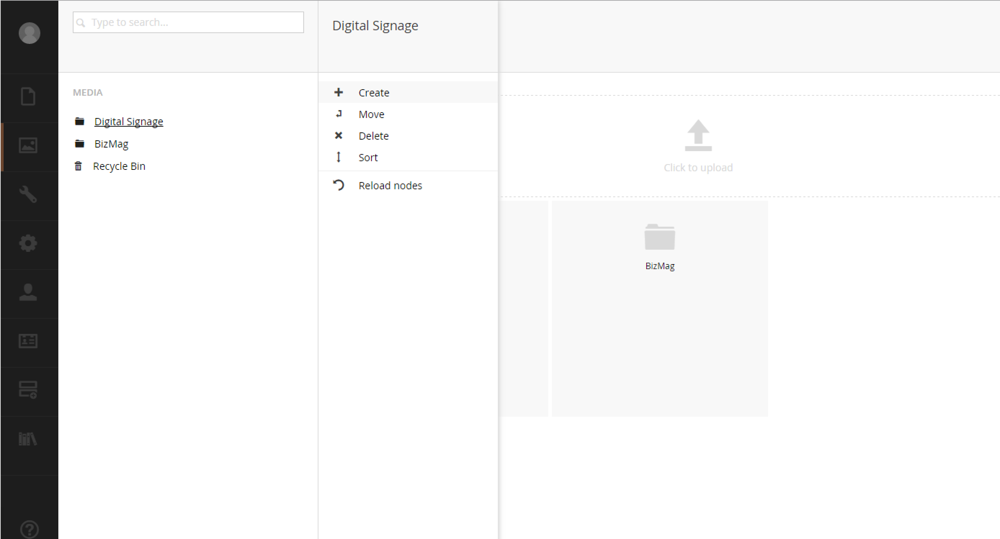

# Developer Section
The developer section is where you'll go to create datatypes, install packages and tinker with Examine among other things.

When building an MVC site, you won't really be using macros so for the purposes of this documentation they won't be talked about but you can find more information from the official core documentation.

## Data Types
Data types live on document types.  They are designed to be the user interaction controls between the editor and Umbraco.  Out of the box the core comes with most of what you need.

Each data type can be configured by setting their `prevalues`.  You can also create multiple instances of a data type and assign specific prevalues.  For instance, maybe you need an RTE that limits the toolbar options.

Data types can be created to Umbraco easily as they are built with AngularJs.  Please see Chapter 11 for more information.  If creating your own data type is a bit much, consider installing pre-built ones from packages on http://our.umbraco.org or http://nuget.org.

## Packages
Packages are Umbraco's way of adding functionality to an instance of the CMS.  You can create your own through the GUI and specify which items you wish to include.

One popular use of the package system is to create a package solely for exporting from a dev system and importing in a staging or production system.

## Dashboard
Finally, the dashboard in the developer section is where you'll find a management tool for Examine.  For more information on Examine, please see Chapter 9.

[<Back 03 - Settings Section](03%20-%20Settings%20Section.md)

[Next> 05 - Users Section](05%20-%20Users%20Section.md)