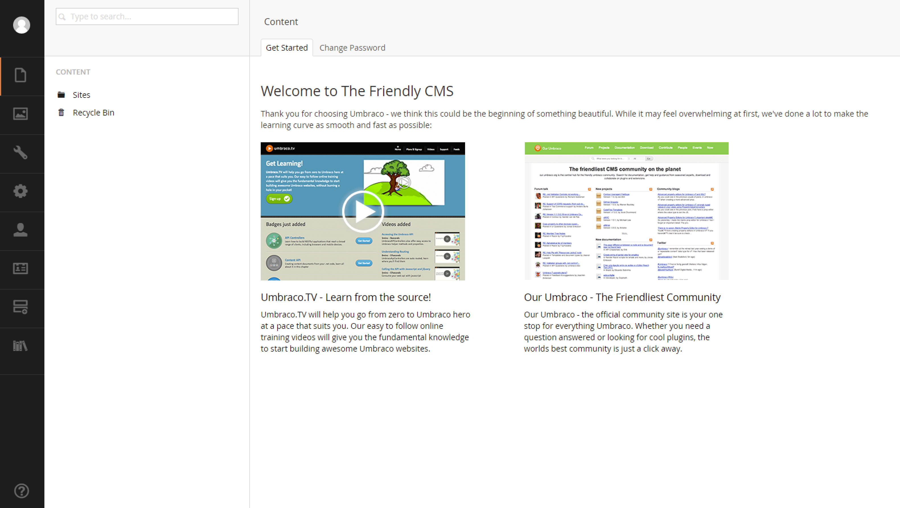

# The Umbraco Backoffice

>Photo by: Doug Robar

The Umbraco backoffice is where the content editors and developers will spend a large part of their time.  The backoffice is broken into several sections:

* [Content](01 - Content Section.md)
* [Media](02 - Media Section.md)
* [Settings](03 - Settings Section.md)
* [Developer](04 - Developer Section.md)
* [Users](05 - Users Section.md)
* [Members](06 - Members Section.md)
* [Forms (New for Umbraco 7)](07 - Forms Section.md)
* And even custom sections can be created like Umbraco Bookshelf

Version 7 has brought a very clean responsive interface powered by AngularJs.  Umbraco sections (called `applications` when developing new sections) consist of a node tree on the left, a contextual panel on the right and dashboards available at the root of each section.

>NOTE: Typically editors are only given access to the `Content` and `Media` section while developers will need access to everything.

[Next> 01 - Content Section](01 - Content Section.md)
