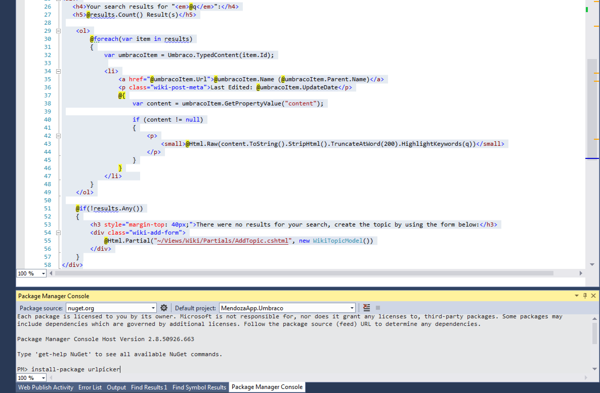
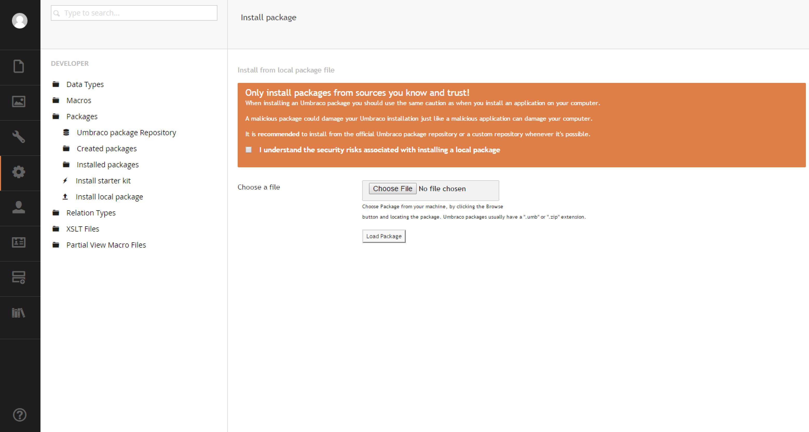

#Overview#

Umbraco provides some pretty awesome features out of the box without much need for additional functionality.  That said Umbraco HQ produces a few paid packages that you might be interested in.  There are many clever third-party packages out there that add some amazing features that you should be aware of.  The next few sections will cover some of the most popular for version 7.

>Most packages in the community are free but some are commercial.

Packages are available in two spots:

*  The official location is from http://our.umbraco.org
* The other place is on http://nuget.org

>NuGet is increasingly becoming more popular for package installations.

##Installing from Nuget##
To install from NuGet, you just have to open the NuGet `Package Manager Console` and type `install-package <packageName>`.  The example below will install the package `urlpicker` (at the bottom of the image).

For more information about NuGet, please consult: http://nuget.org

##Installing from Inside Umbraco##
The *normal* way to install packages is through the `Developer->Packages` section of the backoffice.

>Just remember if you install through the Umbraco backoffice, you'll need to create a separate folder for any files (like .dll's) that need to be included in your source control.

##Tons of Packages##
There are tons of packages on the web compatible with Umbraco 7.  If you use one you really like, consider contributing to this chapter.