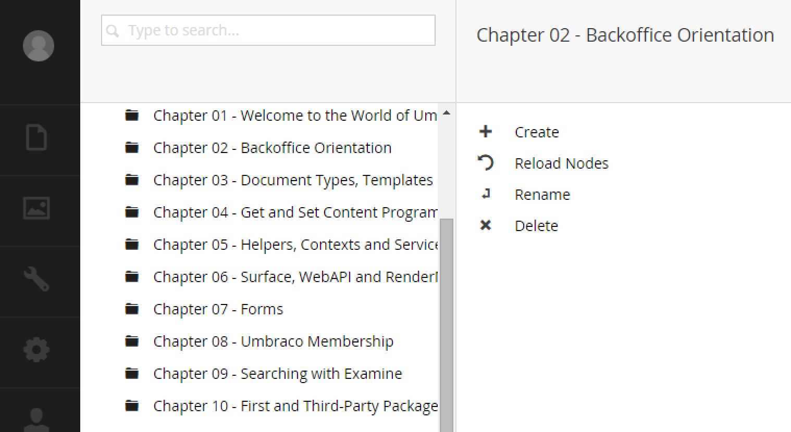
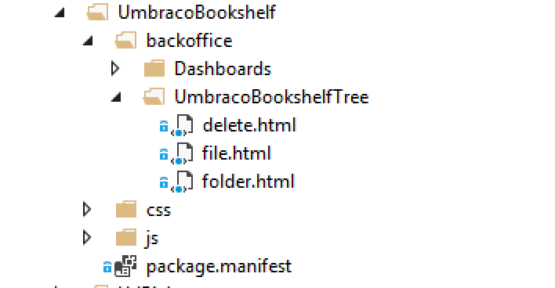

#Custom Tree Menu Actions#

Umbraco allows developers to add custom actions to nodes.  What that means is you can add items to the context menu that opens like the image below:



>Note that most of the actions you'll need are already provided by Umbraco, but you can create a custom action if you need to.

The following example shows how to add existing actions to your custom tree:

```C#
using System;
using System.Net.Http.Formatting;
using umbraco.BusinessLogic.Actions;
using Umbraco.Web.Models.Trees;
using Umbraco.Web.Mvc;
using Umbraco.Web.Trees;

namespace MyNamespace
{
    [PluginController("UmbracoBookshelf")]
    [Umbraco.Web.Trees.Tree("UmbracoBookshelf", "UmbracoBookshelfTree", "Umbraco Bookshelf", iconClosed: "icon-folder")]
    public class MyTree : TreeController
    {
        protected override TreeNodeCollection GetTreeNodes(string id, FormDataCollection queryStrings)
        {
            throw new NotImplementedException();
        }

        protected override MenuItemCollection GetMenuForNode(string id, FormDataCollection queryStrings)
        {
            var menu = new MenuItemCollection();

            //examine the node id, and only add these actions for some items
            if (!id.EndsWith(".md"))
            {
                menu.Items.Add<ActionNew>("Create");
                menu.Items.Add<ActionRefresh>("Reload Nodes");
            }

            //add these to all
            menu.Items.Add<ActionMove>("Rename");
            menu.Items.Add<ActionDelete>("Delete");

            return menu;
        }
    }
}
```

##Action Routing##
By clicking on the 'Create' action, the user will be led to a predetermined URL.  In the case of our example, they'll be sent to:

`http://mydomain.local/umbraco/#/UmbracoBookshelf/UmbracoBookshelfTree/edit/1234`

The node Id (from the tree) is appended to the end as a parameter.

You can then implement a custom view at that destination in your `~/App_Plugins` folder to display whatever you need.

You can change the default route URL to something else by doing the following in your `GetTreeNodes()` method:

```c#
using System;
using System.Net.Http.Formatting;
using umbraco.BusinessLogic.Actions;
using Umbraco.Web.Models.Trees;
using Umbraco.Web.Mvc;
using Umbraco.Web.Trees;

namespace MyNamespace
{
    [PluginController("UmbracoBookshelf")]
    [Umbraco.Web.Trees.Tree("UmbracoBookshelf", "UmbracoBookshelfTree", "Umbraco Bookshelf", iconClosed: "icon-folder")]
    public class MyTree : TreeController
    {
        protected override TreeNodeCollection GetTreeNodes(string id, FormDataCollection queryStrings)
        {
            var nodes = new TreeNodeCollection();

            var node = CreateTreeNode("1234", "4567", queryStrings, "TItle", "icon-folder");

            node.RoutePath = "/UmbracoBookshelf/UmbracoBookshelfTree/folder/1234";

            nodes.Add(node);

            return nodes;
        }

        protected override MenuItemCollection GetMenuForNode(string id, FormDataCollection queryStrings)
        {
            var menu = new MenuItemCollection();

            //examine the node id, and only add these actions for some items
            if (!id.EndsWith(".md"))
            {
                menu.Items.Add<ActionNew>("Create");
                menu.Items.Add<ActionRefresh>("Reload Nodes");
            }

            //add these to all
            menu.Items.Add<ActionMove>("Rename");
            menu.Items.Add<ActionDelete>("Delete");

            return menu;
        }
    }
}
```

To wire all this up, you'll need to create a web structure in your `App_Plugins` directory like so:



Please visit the Bookshelf project for further details: https://github.com/kgiszewski/UmbracoBookshelf/tree/master/src/App_Plugins/UmbracoBookshelf