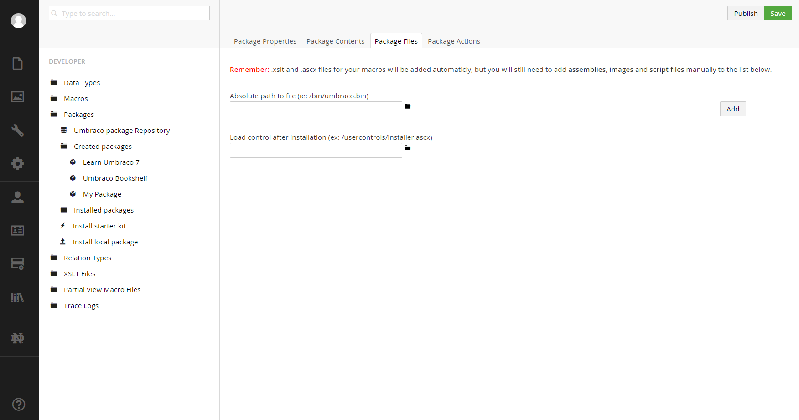

# Built-In
The built-in method is simple and essentially a GUI-based way to select files that will be zipped up.  In addition to files, this method allows for the inclusion of database definitions such as document types and data types. Please do note that if you plan to include data types, the target system should include the required files or you'll have to include them in your package.

>Ideally you'll only include files and little to no database definitions as this can create environment specific issues.

## Let's Create One
Navigate to `Developer->Created Packages` and right click on that node and then select `Create`.

Name your package (smartly) and fill out the first tab called `Package Properties`.

Next click on the `Package Contents` tab and select any database items you need to include.  

>The tricky part here is having to manage your own dependencies as selecting a custom data type doesn't export the required files with it.

Now go to the `Package Files` portion and include any css, js, dlls or whatever you need.

Finally, if you need to do particular things during install/uninstall; you can specify `Package Actions`.  For more on package actions, please consult the official Umbraco docs.

Once you've completed your package selections, you can then return to the `Package Properties` tab to save/publish and finally download your `zip` file.

That's it!  You can now upload it to http://our.umbraco.org and share it with the world.

>Please note that many Umbraco Developers prefer installing your package via NuGet which is covered in the next section.

[<Back Overview](README.md)

[Next> 02 - Create a NuGet Package](02%20-%20Create%20a%20NuGet%20Package.md)