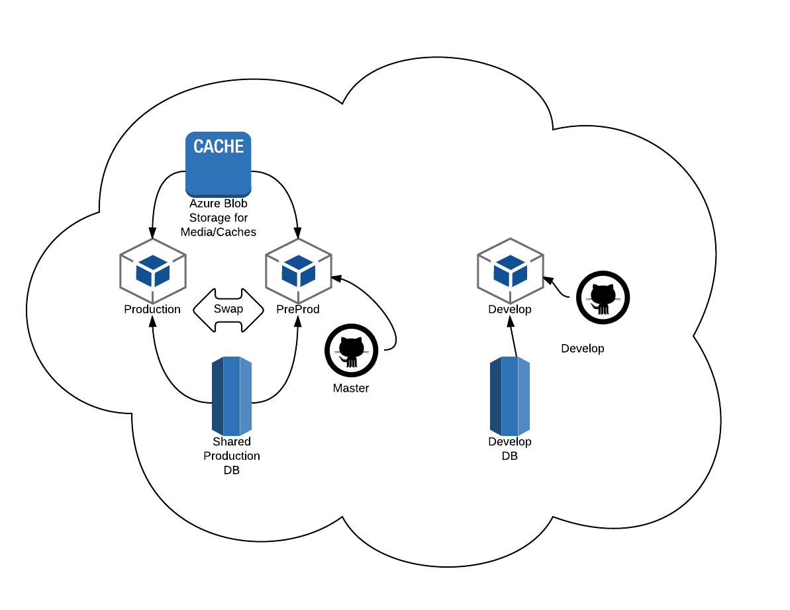

#Slots#

What is an Azure slot?  An Azure slot is essentially a website that is mapped to a URL, a DB, some settings and a code repository.  Functionally speaking, it is very advantageous to be able to push to your `master` branch on GitHub and have it auto deploy to Azure.  But deploying directly from `master` and displaying to the public is somewhat dangerous.  So Microsoft has a feature called `swap`.  It swaps one slot for another.

So as an example, we setup our environment to auto deploy to `preprod` when a push was made to `master`.  This continuous integration speeds up the deployment process greatly.  We then visit our `preprod` slot (that has it's own url) before we make it 'live'.  If after we deploy, we discover a critical issue, we can rollback immediately by hitting 'swap' again.  Of course this is provided you haven't push to `master` in the meantime (as that would have triggered another update of `preprod`.

So when you swap, the website 'references' are swapped.  So what was pointing to your production URL has now been swapped with what was pointing to your preprod URL.  This is important since your `/media` probably will be different (not a good thing).  Your other configs may or may not be swapped, the following was taken from the Azure documentation (http://azure.microsoft.com/en-us/documentation/articles/web-sites-staged-publishing/):

```
Settings that are swapped:

General settings - such as framework version, 32/64-bit, Web sockets
App settings (can be configured to stick to a slot)
Connection strings (can be configured to stick to a slot)
Handler mappings
Monitoring and diagnostic settings
WebJobs content

Settings that are not swapped:

Publishing endpoints
Custom Domain Names
SSL certificates and bindings
Scale settings
WebJobs schedulers
```

##Topology

In order to keep some sort of order and synchronization with your media, you will need to setup your topology as follows:

* Production (not connected to GitHub)
* Preprod (connected to Master branch)
* Production DB (connected to both production and preprod)
* Move media into Azure Blob Storage (connected to both production and preproduction)
* Staging (connected to Develop branch)
* Staging DB connected only to develop slot



The reason for the preprod and production being connected to the same media and DB, this ensures that no resources are lost between swaps.

>You should probably disable auto sync stuff such as uSync.  Perform import operations manaully using those packages instead.
