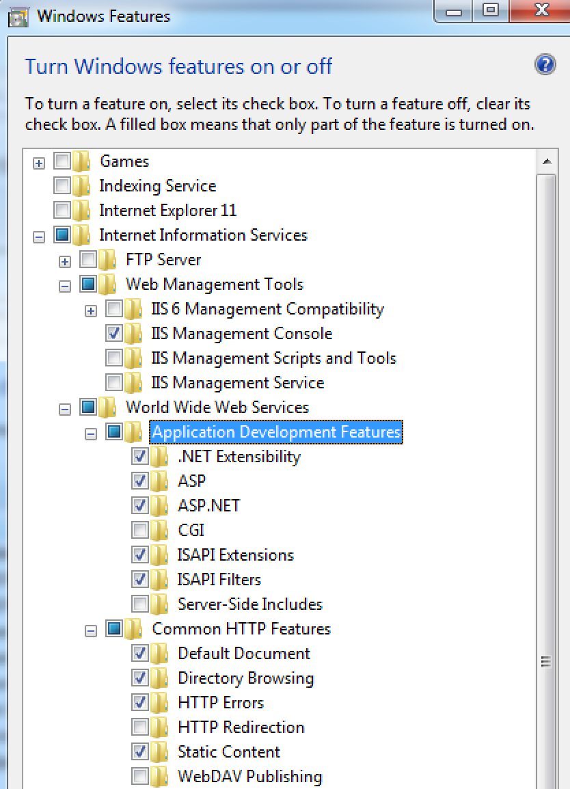

# Install IIS

>Photo by Doug Robar

There are at least two ways to run a website on your local machine.  You can use the built-in IIS in Visual Studio or use IIS Express which comes with OS's like Windows 7/8.

For this book, we need to use IIS Express as it has more features than what is built into Visual Studio.

To install you might have to jump through some hoops but in the end it is well worth it.

To install follow these steps:

1. Open your `Control Panel`
2. Select `Programs and Features`
3. On the area on the left, select `Turn Windows Features on or off`
4. Inspect the image below and turn on the features listed.  Note that some are not required.
5. Hopefully you have .NET 4.5 installed (and if not, Google it).  Your next task is to register .NET and IIS.  There is a cryptic command that should be run.  You have to run it from the cmd prompt while the command prompt is run as an admin.  The command to run is: `C:\Windows\Microsoft.NET\Framework\v4.0.30319>aspnet_regiis -i`
6. Reboot

