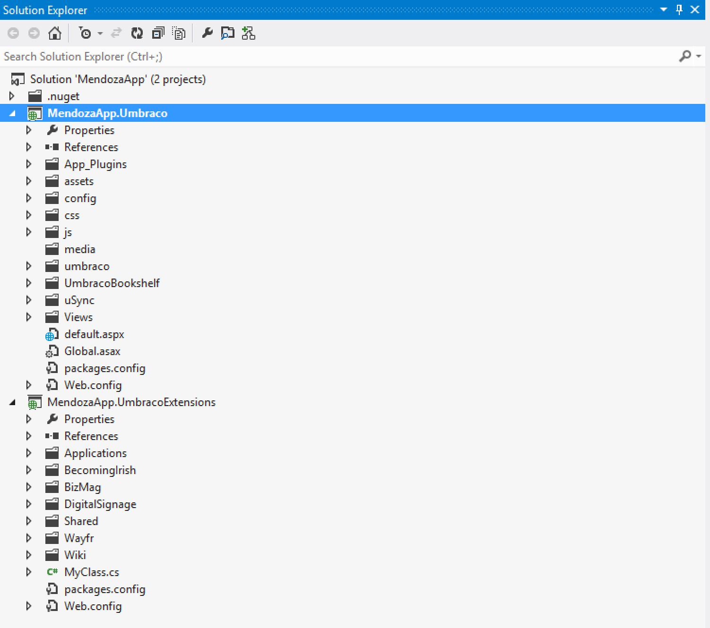

#Anatomy of an Umbraco Project#

Managing multiple technologies in one Visual Studio solution can be a bit intimidating. There are an infinite number of ways to organize these files/folders. What follows next is a case study of how one project is organizing the following:

* An Umbraco 7 CMS project
* An Umbraco 7 Extensions project
* An Umbraco 7 package installed from the built-in installer
* Umbraco 7 packages installed with NuGet
* Grunt (a Node.js taskrunner)
* GitHub files
* Vendor files

##The Root##

At the top level of this project, we find several technologies.  The root level will house these files/folders:

* GitHub files/folders (`/.git`, `README.md`, `.gitignore`)
* Our Grunt files (`grunfile.js`, `package.json`)
* Any Umbraco package DLL's that weren't installed with NuGet (`/lib`)
* Vendor files are kept in  `/vendor` (files like a purchased template)
* Umbraco and .NET files/folders are kept in `/src`

##/src##
In this folder we will find the following:

* `/.nuget` holds the`NuGet.exe` that is automatically installed if the NuGet auto-restore option is installed.
* Our solution file
* Our two .NET projects, one for the CMS and one for extending the CMS

##Solution Organization##

Below you will find our solution in Visual Studio.  We installed Umbraco into the first project with NuGet and we installed `UmbracoCms.Core` from NuGet into the second project.

We then reference the second project in the first project.

Lastly, don't forget to reference (in the first project) any DLL's from your root `/lib` folder that are from any projects not installed with NuGet.

>Please note the second project was created as an empty web application.  This was done to make accessing the `web.config` configuration manager easier to do.