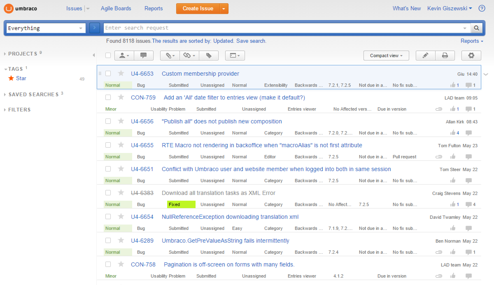

# Contribute to a Project

So when you eventually get the courage to make a change to another repo, you'll need to follow a few steps in order to contribute.

The process is the following:

1. Fork the repo you want to change.  This creates a copy in your user account.
2. Clone the repo to your local machine so you can edit it.
3. Make changes and test it.
4. Commit your changes and push to GitHub.
5. Create a pull request with the original repo as the destination.
6. Wait and see if it gets accepted.

>If you have already forked a repo but some time has passed, you will need to update your local fork by updating from the *upstream*.  Give it a Google to see how to do it.

## Tips for Contributing to the Umbraco Core
Umbraco is a fast moving project so make sure you have the latest version sync'ed locally.  You will also need to register an entry on their [bug tracker](http://issues.umbraco.org).  This allows the core team to track things in their project management.  Finally, there are several versions being developed at any one time so you may need to check to see which branch you should be modifying.

[<Back 04 - Git Extensions](04 - Git Extensions.md)

[Next> 06 - Command Line](06 - Command Line.md)