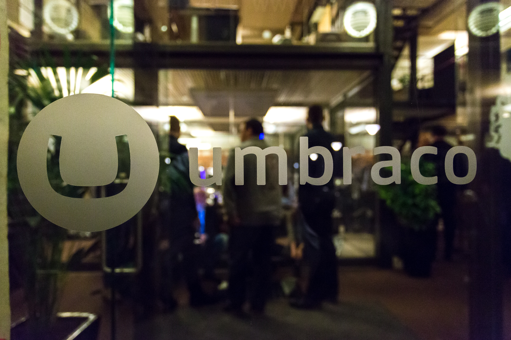

#GitHub#

>Photo by Doug Robar

GitHub has become the defacto version control tool that the Umbraco core team uses.  As such it is probably a good idea to give a brief immersion into what GitHub is and what it can do for you.  If you are not using any sort of version control, start today, you won't regret it.

##What is GitHub?##

GitHub is a website that hosts your repositories (you code) and keeps track of things in a nice visual way.  GitHub uses [Git](http://en.wikipedia.org/wiki/Git_%28software%29), a technology created by Linux creator [Linus Torvalds](http://en.wikipedia.org/wiki/Linus_Torvalds).  GitHub does a great job of visually showing you differences in your code over time and manages merging independent effort on the same project (branches).

When using GitHub, it is important to know that when you make changes on your local machine, GitHub will not know about it until you perform an update (called a *push*).  Similarly, any changes made and pushed to GitHub by your team will not be known to your local machine until you perform a *pull*.

The important concept here is that you are running Git locally on your machine and GitHub is running Git on their servers.

[Next> 01 - Terms](01 - Terms.md)
