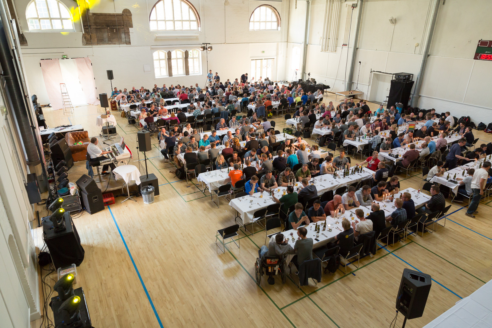

# Installing SQL Server

>Photo By: Doug Robar

One decision you will have to make is "where will the database live?".  This is purely a matter of preference.  Your choices are:

* SQL CE (default but [deprecated](http://stackoverflow.com/questions/18598506/is-microsoft-dropping-support-for-sdf-database-files-in-visual-studio))
* SQL Server Express (It's free!)
* SQL Azure
* MySQL

SQL CE is a popular choice as it's stored in a local file and is a very fast way to get going.  However if you foresee having the typical staging and production environments, you may want to consider installing SQL to either Azure or in a traditional instance on your dev machine.

Rather than show you wizard screenshots of how to install SQL Server, just google for it but make sure to get SQL Server Management Studio (SSMS) as well.  It will make migrating environments a bit easier and if you ever decide to put your DB in Azure later, there are built-in ways to do so.  There are also Visual Studio features that allow you to connect to a DB without SSMS.
>Please note as of this writing, Microsoft's downloading screens make it pretty unclear of what to download.  Typically you will have to download an install SQL and then download another file for SSMS.

You can also use a hybrid approach by placing your production DB in Azure, your staging in another DB on Azure and just use a local DB on your development machine.  Different developers and teams have a preference on how to set this up.  Many want isolation from environments while others need to coordinate through a single DB source.